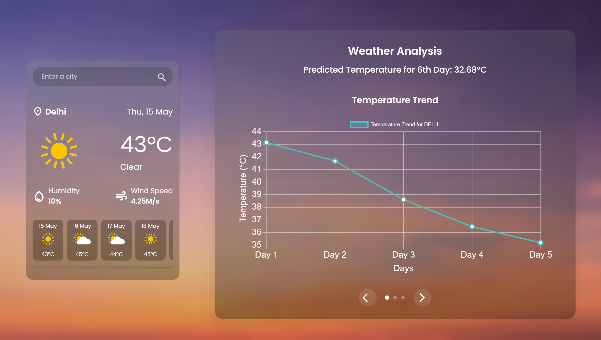

# Weather App

This is a simple, clean and attractive Weather App that fetches real-time weather data from the OpenWeather API and displays the current weather conditions and a forecast for the selected location. Integrated Python backend libraries to display graphical report analysis of the weather conditions. The app is built using **HTML**, **CSS**, **JavaScript** and **Python** .

---

## Demo



## Features

- Fetches weather data for any city using the OpenWeather API.
- Displays:
  - Current temperature
  - Weather conditions (e.g., sunny, rainy, etc.)
  - Wind speed
  - Humidity
  - 5-day weather forecast
  - Temperature Prediction Chart
  - Temperature Variation Chart
  - Humidity and Wind Speed Chart
- Responsive design for an optimal experience on different devices.
- User-friendly interface for searching and viewing weather details.

---

## Technologies Used

- **HTML**: For structuring the app layout.
- **CSS**: For styling the app and ensuring responsiveness.
- **JavaScript**: For dynamic data fetching and updating the UI.
- **OpenWeather API**: For accessing real-time weather data.
- **Python**: For predicting and displaying charts.

---

## How It Works

1. **Search for a Location**: Enter the name of the city in the search bar.
2. **Fetch Weather Data**: The app sends a request to the OpenWeather API to retrieve weather information.
3. **Display Results**: The app dynamically updates the UI with the current weather details and forecast.
4. **Display Charts**: It dynamically updates the UI with the 3 charts that can be navigated using the navigation buttons.

---

## Installation

1. Clone this repository:
   ```bash
   git clone https://github.com/your-username/weather-app.git
   ```
2. Navigate to the project directory:
   ```bash
   cd weather-app
   ```
3. Open the `index.html` file in your browser to view the app.

---

## API Integration

- The app uses the **OpenWeather API** to fetch weather data.
- Sign up at [OpenWeather](https://openweathermap.org/) to get your API key.
- Replace the placeholder `API_KEY` in the `script.js` file with your OpenWeather API key:
  ```javascript
  const apiKey = "YOUR_API_KEY";
  ```

---

## Future Enhancements

- Add support for geolocation to fetch weather for the user's current location.
- Display additional weather parameters like UV index or air quality index.
- Allow users to save favorite locations.

---

## License

This project is open-source and available under the [MIT License](LICENSE).

---

## Acknowledgements

- [OpenWeather API](https://openweathermap.org/) for providing the weather data.
- Inspiration from various tutorials and projects.
